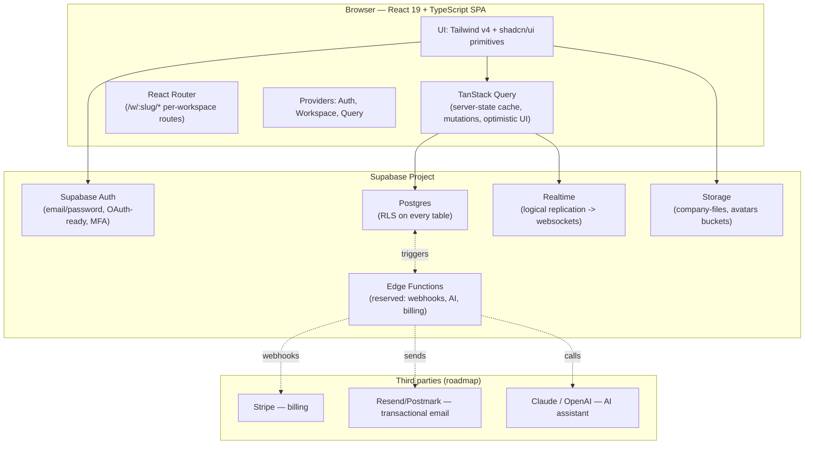

# BizLab — Product & System Architecture

BizLab is a multi-tenant SaaS "operating system" for businesses: tasks &
projects, documents, file storage, team chat, whiteboards, dashboards and a
company knowledge base, unified behind one auth/permissions/notification
layer.

## 1. High-level architecture



The frontend never talks to a custom backend server: Supabase-generated
REST/RPC (PostgREST) and Realtime **are** the API. Every table is protected
by row-level security, so the same Postgres policies enforce tenant
isolation and RBAC for the browser client, a future mobile client, and any
server-side job — there is only one authorization surface to audit.

## 2. Why this stack

| Layer | Choice | Why |
|---|---|---|
| Build | Vite | Instant HMR, fast builds, first-class React 19 support |
| UI | React 19 + TypeScript | Type-safe, huge ecosystem, concurrent rendering |
| Styling | Tailwind v4 + shadcn/ui | Own the component code (no black-box UI kit), consistent design tokens, dark mode for free |
| Server state | TanStack Query | Caching, retries, invalidation — avoids hand-rolled data-fetching state machines |
| Backend | Supabase (Postgres + Auth + Realtime + Storage) | One managed platform for DB, auth, file storage and live updates; RLS gives us tenant isolation *in the database*, not just in application code |
| Hosting | Vercel | Zero-config static/SPA hosting, preview deployments per PR |

## 3. Multi-tenancy model

Every tenant-scoped table carries a `company_id`. There is no
schema-per-tenant or database-per-tenant — isolation is enforced by
**Postgres Row-Level Security** via `is_company_member(company_id)` and
`has_min_role(company_id, role)` (see `supabase/migrations/0002_core_tenancy.sql`).
This is simpler to operate at BizLab's target scale (SMEs/agencies, not
regulated enterprises requiring physical data separation) and keeps a
single connection pool / migration history. If a future enterprise
customer requires physical isolation, Supabase branches or a dedicated
project per tenant is the documented escape hatch (see ROADMAP.md).

A user's relationship to companies is many-to-many through
`company_members`. A user with 3 companies (e.g. "Oman belongs to Tablo,
Odax, Nova") sees a **workspace switcher** and every route is scoped under
`/w/:slug/...`; the `WorkspaceProvider` resolves `slug -> company + membership`
and every query hook filters by `company.id`.

## 4. Frontend folder structure

```
src/
├── components/
│   ├── ui/            # shadcn/ui primitives (button, dialog, select, ...)
│   ├── layout/         # Sidebar, Topbar, WorkspaceSwitcher, NotificationsBell
│   ├── shared/         # PageHeader, Logo — cross-module building blocks
│   ├── tasks/           # Kanban board, task card, task dialog, badges
│   ├── projects/        # Project dialog
│   └── dashboard/       # Widget card + widget renderer
├── hooks/               # one file per data domain (use-tasks, use-documents, ...)
├── providers/            # AuthProvider, WorkspaceProvider, QueryProvider
├── pages/                # route components, one folder per module
│   ├── auth/, onboarding/, dashboard/, tasks/, projects/, documents/,
│   │   files/, chat/, whiteboards/, knowledge/, notifications/, search/,
│   │   settings/
├── routes/               # RequireAuth guard
├── lib/                  # supabase client, permissions matrix, utils
└── types/                # hand-written Database types (see below)

supabase/
└── migrations/           # 0001‑0012, applied in order, see DATABASE_SCHEMA.md

docs/                      # this folder
```

Each `pages/<module>/*.tsx` is a thin composition of `components/<module>/*`
and `hooks/use-<module>.ts`; hooks are the only place Supabase queries are
written, so RLS/permission changes and query-key invalidation stay in one
place per domain.

## 5. API architecture

BizLab intentionally has **no bespoke REST/GraphQL server**. Three API
surfaces, all provided by Supabase and all governed by the same RLS
policies:

1. **PostgREST (auto-generated REST over Postgres)** — reached through
   `@supabase/supabase-js`'s `.from(table).select()/.insert()/.update()/.delete()`.
   This is 95% of BizLab's data access (tasks, projects, documents, files,
   messages, etc.).
2. **Postgres RPC functions** — for logic that must run server-side or
   spans multiple tables in one round trip: `global_search(company_id, query)`
   (0012), `is_company_member`, `has_min_role`, `document_access_level`
   (0002/0004). Called via `supabase.rpc('global_search', {...})`.
3. **Realtime channels** — `postgres_changes` subscriptions on
   `notifications`, `chat_messages` (see `use-notifications.ts`,
   `use-messages.ts`); whiteboards broadcast cursor/element deltas over a
   Realtime channel in addition to periodic full-document saves.

**Edge Functions** (Deno, deployed alongside the Supabase project) are
reserved for logic that must not run in the browser: Stripe webhook
handling, sending transactional email, and — per the AI-ready mandate —
an `ai-assistant` function that wraps an LLM call with the same RLS-scoped
Postgres access (see ROADMAP.md and the "AI-ready foundation" section of
SECURITY.md). None of these are implemented yet; the schema and
permission model are shaped so they slot in without migrations.

## 6. Realtime & collaboration

| Feature | Mechanism |
|---|---|
| Chat messages | `postgres_changes` INSERT subscription per channel |
| Notifications | `postgres_changes` INSERT subscription per user |
| Whiteboards | Full-document JSONB save (debounced) today; Realtime Broadcast channel for live cursors/elements is the documented next step (ROADMAP) |
| Documents | Debounced autosave today; presence + Realtime Broadcast for live multi-cursor editing is the next step (ROADMAP) |

## 7. AI-ready foundation

No AI is implemented, but the schema and architecture were deliberately
shaped so an AI assistant can be added without breaking changes:

- `knowledge_articles`, `documents` and `chat_messages` already store
  structured, queryable content an LLM can be grounded on (RAG) — the
  `pg_trgm`/`tsvector` indexes in 0009/0012 are the retrieval substrate.
- `activity_logs` gives a clean, per-entity event stream an AI summarizer
  can consume ("what happened on Project X this week?").
- Every table is already RLS-scoped by `company_id`, so a future
  `ai-assistant` Edge Function that runs with the *caller's* JWT (not a
  service key) automatically inherits correct tenant/role scoping for any
  question it answers or any task it creates on the user's behalf.
- `recurrence_rule` (tasks) and `config`/`layout` (dashboard widgets) are
  JSONB, leaving room for AI-generated structured output without schema
  changes.

See ROADMAP.md §"AI Assistant" for the concrete rollout plan.
