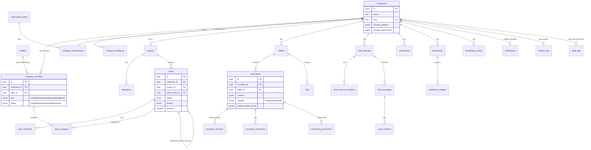

# BizLab — Database Schema

Source of truth: `supabase/migrations/0001…0012_*.sql`. This document is a
map of that SQL, not a replacement for reading it — every table below has
full column definitions, indexes, triggers and RLS policies in its
migration file.

## Migration order

| # | File | Introduces |
|---|---|---|
| 0001 | `extensions_helpers.sql` | Extensions (`pgcrypto`, `pg_trgm`, `unaccent`), `set_updated_at()` trigger, `profiles` (mirrors `auth.users`) |
| 0002 | `core_tenancy.sql` | `companies`, `company_members`, `company_invitations`, `permission_overrides`, RBAC helper functions |
| 0003 | `tasks_projects.sql` | `projects`, `project_members`, `milestones`, `tasks`, `task_assignees`, `task_comments`, `task_attachments` |
| 0004 | `documents.sql` | `folders`, `documents`, `document_versions`, `document_permissions`, `document_comments` |
| 0005 | `files_storage.sql` | `files`, `file_shares`, `company_storage_usage` view, Storage bucket policies |
| 0006 | `chat.sql` | `chat_channels`, `chat_channel_members`, `chat_messages`, `chat_reactions`, company-default seed trigger |
| 0007 | `whiteboards.sql` | `whiteboards`, `whiteboard_collaborators` |
| 0008 | `dashboards.sql` | `dashboards`, `dashboard_widgets` |
| 0009 | `knowledge_hub.sql` | `knowledge_articles` |
| 0010 | `notifications_activity_audit.sql` | `notifications`, `activity_logs`, `audit_logs` |
| 0011 | `billing_subscriptions.sql` | `subscription_plans`, `company_subscriptions`, `invoices` |
| 0012 | `global_search.sql` | `global_search()` RPC (cross-entity search) |

## Entity relationship diagram



## Design decisions worth calling out

- **`company_members.id` (not `user_id`) is the foreign key used
  everywhere else** (`task_assignees`, `project_members`,
  `document_permissions`, `chat_channel_members`, `permission_overrides`).
  This keeps a member's role/title/department scoped per-company even
  though `profiles`/`auth.users` are global — the same human is a
  different "member" row in Tablo vs. Odax vs. Nova.
- **Polymorphic-by-convention, not polymorphic FKs.** `activity_logs` and
  `notifications` reference `entity_type` + `entity_id` as plain text/uuid
  rather than a real foreign key, because a single activity feed spans
  many tables. Application code is responsible for the entity_type
  vocabulary (`'task' | 'project' | 'document' | ...`).
- **JSONB where the shape is expected to evolve without a migration**:
  `documents.content` / `knowledge_articles.content` (rich text),
  `tasks.recurrence_rule`, `whiteboards.canvas_data`,
  `dashboard_widgets.config/layout`, `companies.security_settings`. Every
  other column is strongly typed — JSONB is the exception, not the
  default.
- **Search** uses `pg_trgm` trigram indexes (`gin_trgm_ops`) per searchable
  column plus the `global_search()` RPC (0012) that unions ranked results
  across tasks/projects/documents/files/chat/knowledge/people in one round
  trip, filtered through each table's own RLS so results never leak
  cross-tenant or past a user's document/channel access.
- **Storage quota** is tracked via a `company_storage_usage` view
  (`sum(file_size)` over non-deleted `files`) rather than a maintained
  counter column, trading a bit of query cost for zero risk of the counter
  drifting from reality.
- **Seed triggers**: `seed_company_defaults()` (0006) and
  `seed_company_subscription()` (0011) fire `AFTER INSERT ON companies` to
  give every new workspace its owner membership, default channels
  (General/Announcements/Product/Sales/Marketing/Support), default
  document folders (HR/Sales/Finance/Marketing/Operations), a default
  dashboard with starter widgets, and a trialing Free subscription — so a
  brand-new company is immediately useful, matching the "extremely simple
  UX" principle.

## Generating real TypeScript types

`src/types/database.ts` is hand-written to mirror this SQL 1:1. Once a
Supabase project is linked, regenerate it from the live schema instead of
maintaining it by hand:

```bash
supabase gen types typescript --linked > src/types/database.ts
```

(or the `mcp__Supabase__generate_typescript_types` tool in this workspace).
